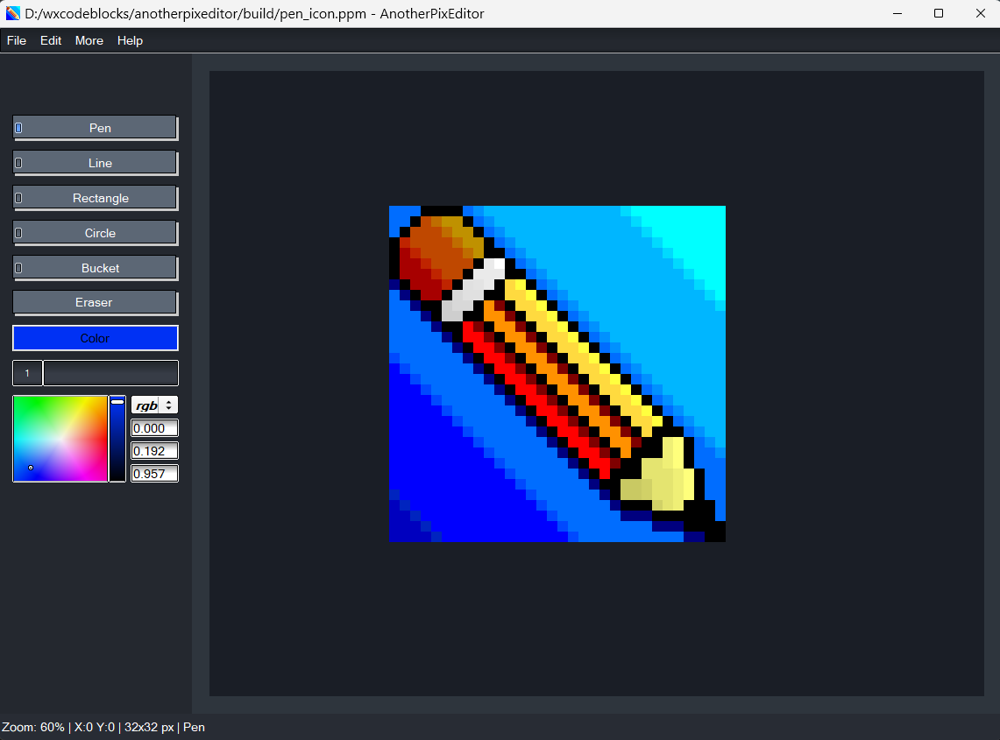

# AnotherPixEditor

A lightweight and easy-to-use pixel art editor built with FLTK.

## About

AnotherPixEditor is a simple pixel art drawing program. It is just another pixel Editor.

### Features

- **Drawing Tools**: Pen, Line, Rectangle, Circle, and Bucket Fill
- **Eraser Tool** with automatic switch back to Pen
- **Brush Size** adjustment slider
- **Full RGB Color Chooser**
- **Eyedropper** tool (Alt + Click to pick color from canvas)
- **Undo and Redo** (up to 50 steps)
- **Zoom** in and out using mouse wheel
- **Pan** the canvas with middle mouse button
- **Mirror Mode** (Horizontal and Vertical)
- **Flip** canvas horizontally or vertically
- **Grid** toggle for precise pixel work
- **New Canvas** with custom size (N x N)
- **Save / Load** images in PPM format (P3)

Built with **FLTK 1.4.4**, compiled using **g++** and **CMake + Ninja**.

## Screenshots



## How to Run (Windows)

1. Download the latest release
2. Extract the zip file
3. Run `AnotherPixEditor.exe`

## Building from Source

### Requirements

- FLTK 1.4.4 (built and installed)
- CMake
- Ninja
- g++ (MinGW-w64)

### Build Steps

```bash
git clone https://github.com/M-H-Jim/anotherpixeditor.git
cd AnotherPixEditor
mkdir build && cd build
cmake -G Ninja .. -DCMAKE_PREFIX_PATH="path to your fltk root dir" -DCMAKE_BUILD_TYPE=Release
cmake --build .
